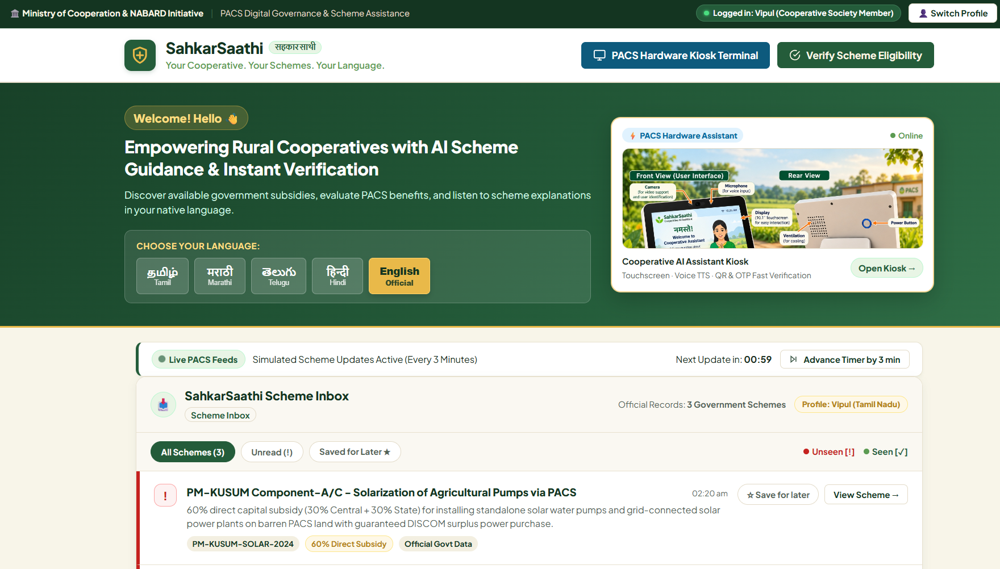

# 🌾 SahkarSaathi (सहकारसाथी)
### Multilingual Cooperative Governance & PACS Legal Assistance Assistant
**Smart India Hackathon (SIH) Edition**

[](https://opensource.org/licenses/MIT)
[]()
[]()



SahkarSaathi is a comprehensive, nature-inspired digital governance platform designed for Primary Agricultural Credit Societies (PACS), farmers, and cooperative members across India. It bridges regional language barriers, provides official scheme awareness, and accelerates statutory document verification.

---

## 🌟 Key Features

1. **🌾 Nature-Inspired Agricultural Design:**
   - Palette tailored for rural & cooperative identity (Forest Green `#245C3A`, Leaf Green `#5C9B52`, Warm Cream `#F8F5E9`, Harvest Gold `#E9B949`).
   - Accessible typography, elevated cards, and mobile-friendly responsive layout.

2. **🌐 1-Tap Multilingual Support & Voice (TTS):**
   - Instant regional switching for **தமிழ் (Tamil)**, **मराठी (Marathi)**, **తెలుగు (Telugu)**, **हिंदी (Hindi)**, and **English**.
   - Built-in Browser Web Speech API text-to-speech for audible scheme assistance in native dialects.

3. **🏛️ 3 Official Government Schemes:**
   - **PACS Computerization Project** (Centrally Sponsored ERP Cloud Infrastructure - Up to ₹4.0 Lakhs grant).
   - **Agriculture Infrastructure Fund (AIF)** (3% Interest Subvention on loans up to ₹2.0 Crore).
   - **PM-KUSUM Component A/C** (60% capital subsidy for solar agricultural pumps & feeder solarization).

4. **⚡ PACS Office Fast Verification Assistant Terminal:**
   - **Step 1:** Laser-based QR Code Reader & Membership scanner.
   - **Step 2:** SMS OTP security check simulator (`482910`).
   - **Step 3:** Statutory Document Checklist Evaluator returning direct **YES (Qualified)** or **NO (Missing Docs)** decisions.
   - **Step 4:** Official Printable Audit Slip with reference IDs and date/time stamps.

5. **📬 Smart Timed Inbox System:**
   - Auto-updating scheme alerts (under 5 minutes / 3-minute demo cadence).
   - Seen (`✓`) vs. Unseen (`!`) status tracking and "Save for Later" bookmarking.

6. **👤 3-Persona Demonstration Mode:**
   - **Murugan K** (Farmer Member, Salem, Tamil Nadu - PM-KUSUM)
   - **Ramesh Patil** (PACS Secretary, Kolhapur, Maharashtra - AIF 3%)
   - **Venkat Rao** (Cooperative Member, Guntur, Andhra Pradesh - PACS ERP)

---

## 🛠️ Technology Stack

- **Frontend:** Pure Vanilla HTML5, CSS3, JavaScript (ES6+)
- **Security:** XSS protection with HTML sanitization, masked Aadhaar data handling, zero private token exposure
- **Dependencies:** Zero external npm packages required (100% static & serverless ready)

---

## 🚀 How to Run Locally

Clone the repository and start any static web server:

```bash
# Clone the repository
git clone https://github.com/Code4-SK/SahkarSaathi.git

# Navigate to project folder
cd SahkarSaathi

# Run with Python
python -m http.server 8080
```

Open your browser and navigate to:
```
http://localhost:8080/
```

---

## 📄 License
This project is open-source under the [MIT License](LICENSE).
